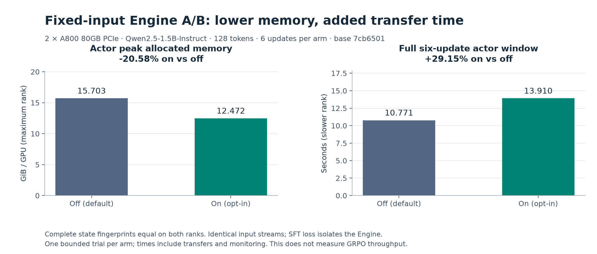
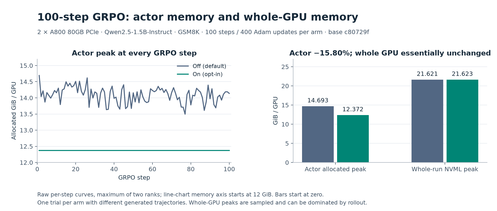
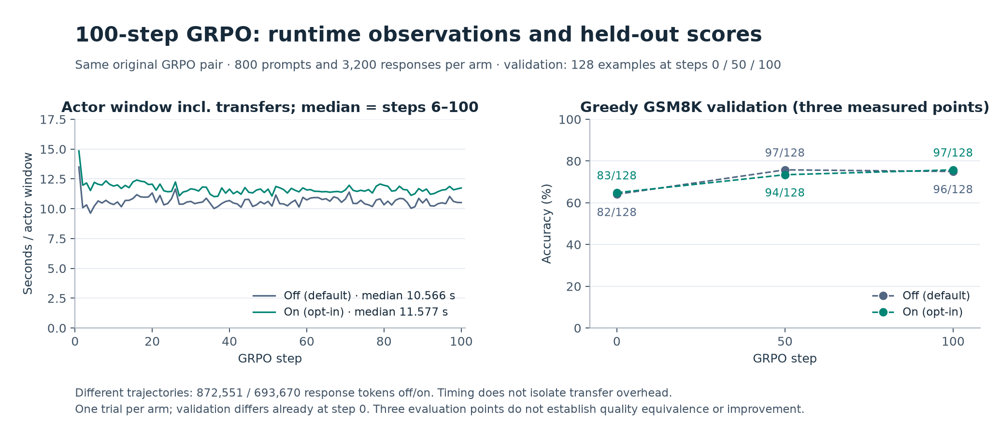

# [fsdp, perf] feat: offload optimizer states around each update

Draft submission preview. The upstream PR has not been opened; the human-review checklist remains pending.

### What does this PR do?

With manual optimizer offloading, the FSDP Engine loads optimizer states on entering a training context. When that context spans several mini-batches or epochs, Adam states remain on the GPU during forward and backward computation. Add `optimizer_offload_step=False` so memory-constrained users can keep those states on CPU until an actual parameter update.

The behavior lives in the FSDP Engine's training context and finite-gradient update branch. It reuses existing transfers, loads states after gradient clipping, and offloads them in `finally` after `optimizer.step()`. Nested manual contexts retain the outer automatic context's policy; a top-level `disable_auto_offload=True` keeps caller-managed transfers. The default path, shared BaseEngine, training algorithms, and checkpoint format are unchanged.

The option requires FSDP2, manual `optimizer_offload=True`, `offload_policy=False`, and standard `torch.optim.AdamW` without a gradient scaler. Parameter offloading is independent. Ordinary, foreach, and fused AdamW variants are covered. Unsupported opt-in configurations fail explicitly.

Related to #5282. This builds on the direction explored in the closed #5657 and follows the maintainer's request to implement it in the new FSDP Engine.

### Test

- 58 selected CPU configuration and Engine regression tests passed; all repository pre-commit hooks passed for the changed files. Both passed on the current base, main `7cb6501`.
- Real two-rank DTensor tests cover six parameter-offload/AdamW combinations, complete local parameter and optimizer equality, gradient accumulation, global nonfinite-gradient skipping, nested contexts, and state reload across the option change.
- Full Qwen2.5-1.5B fixed-input checks compare single-GPU upstream/off/on and dual-GPU off/on fingerprints. Final-source dual-GPU 128-token repetition and 8192-token checks match complete parameter, optimizer, buffer, scheduler, parameter-group and RNG fingerprints on both ranks.
- Two A800 GRPO trials completed 100 steps / 400 global Adam updates each, with validation and checkpoints at 50/100. Both actual checkpoint resume directions passed through step 102: complete actor state restored, Adam counters 400→408, scheduler 100→102, and the next 16 dataset examples consumed.

### Benchmark

Same host, 2×A800 80GB PCIe (SYS topology, no NVLink), Qwen2.5-1.5B-Instruct, GSM8K, two-rank FSDP2 actor/reference and two TP=1 rollout replicas. Each trial consumed 800 prompts and generated four responses per prompt; each actor window performed four global Adam updates. Only the option and output paths/names differ in the effective configuration.

| Metric | Off | On |
|---|---:|---:|
| Full actor-window allocated peak, maximum rank | 14.693 GiB | 12.372 GiB |
| Whole-run sampled NVML peak, maximum GPU | 21.621 GiB | 21.623 GiB |
| Steady actor-window median, including transfers | 10.566 s | 11.577 s |
| Steady training-step median | 27.925 s | 26.398 s |

Actor peak decreases by 15.80%, with +9.56% actor median time. Actor and whole-GPU peaks measure different scopes; rollout memory can dominate the latter. The single-GPU 128-token case had little memory benefit and appreciable transfer overhead, supporting an opt-in default.

These are one GRPO trial per arm, with different generated trajectories despite matching sampling requests; they do not establish a quality improvement or a general speedup. Steady actor statistics exclude the first five steps; steady training-step statistics also exclude checkpoint steps. Full wall times include initialization, validation and checkpoint auditing, including baseline checkpoint relocation for disk capacity, so they are not used for pure performance attribution. Strict numerical equivalence is checked separately with fixed inputs. The original 100-step and checkpoint GPU runs use `c80729f`. The initial delivery alignment to `d040717` only adds an Ascend vLLM patch; current-main reviewer-entrypoint acceptance is recorded separately below.

The off/on trials generated 872551 / 693670 response tokens respectively. The shorter enabled trajectory means the GRPO timing comparison does not isolate transfer overhead; its lower overall step time is not evidence of a speedup.

### Benchmark figures

The figures below are derived from existing raw measurements. Each experiment
has one trial per arm. [Plotted values, source hashes and regeneration script](figures/README.md)
are available alongside the original evidence archives.

#### Controlled fixed-input Engine A/B (current-main acceptance)



On base `7cb6501`, the six-update, 128-token check reduced actor peak allocated
memory from 15.703 to 12.472 GiB (−20.58%) and increased the complete actor window
from 10.771 to 13.910 s (+29.15%). Full state fingerprints and input streams match
on both ranks. This uses the SFT loss to isolate the Engine; it is a bounded
memory/correctness check, not an end-to-end GRPO throughput measurement.

#### Original 100-step GRPO memory



These are the original `c80729f` runs described in the table above. All 100 raw
per-step actor peaks are shown without smoothing. Actor allocated peak drops
15.80%; sampled whole-GPU peak is essentially unchanged. The line chart has a
12 GiB lower bound to show variation; the accompanying bars use a zero baseline.

#### Original GRPO runtime and held-out validation



Actor median time over steps 6–100 rises from 10.566 to 11.577 s in this pair.
The two arms generated different response lengths, so this is observational
timing. Validation is measured only at steps 0, 50 and 100 on 128 held-out
examples. The initial scores already differ; the final result is 96/128 off and
97/128 on. These three points do not establish quality equivalence, improvement,
or convergence. Fixed-input tests provide the strict state comparison.


AI assistance: Codex was used for implementation, tests, experiment automation, and writing. The recorded commands and experiment runs below were executed by Codex.

### Reviewer reproduction

The companion [reviewer kit ZIP](https://raw.githubusercontent.com/yue-zeng-yue/verl/ec26aee09ef6f736cee2d5685bab3bea4c140eaa/review-artifacts/VERL_FSDP2_REVIEWER_KIT.zip) (1.18 MB) contains portable
launchers, the prepared GSM8K subset with provenance, and the implementation patch.
Follow the [quick-start README](https://github.com/yue-zeng-yue/verl/blob/ec26aee09ef6f736cee2d5685bab3bea4c140eaa/review-artifacts/reviewer_kit/README.md);
[browsable scripts and checksums](https://github.com/yue-zeng-yue/verl/blob/ec26aee09ef6f736cee2d5685bab3bea4c140eaa/review-artifacts/README.md),
[acceptance scope](https://github.com/yue-zeng-yue/verl/blob/ec26aee09ef6f736cee2d5685bab3bea4c140eaa/review-artifacts/reviewer_kit/VALIDATION.md), and the immutable
[original 100-step evidence ZIP](https://raw.githubusercontent.com/yue-zeng-yue/verl/ec26aee09ef6f736cee2d5685bab3bea4c140eaa/review-artifacts/VERL_A800_REVIEW_BUNDLE.zip) (15.98 MB)
are public. These materials live on a separate branch in the contributor fork;
the upstream patch contains only the feature, configuration, docs and small tests.
Archived PR drafts inside the ZIPs are historical snapshots.
Use an activated Linux Python 3.12 FSDP/vLLM environment and expose two idle CUDA
GPUs. The small regression requires no downloaded model or dataset:

```bash
torchrun --standalone --nproc-per-node=2 \
  tests/special_distributed/test_fsdp2_optimizer_offload_step.py
```

With `REVIEW_KIT`, `VERL_SOURCE` and `REVIEW_MODEL` set as described in the kit:

```bash
python "$REVIEW_KIT/review.py" fixed \
  --source "$VERL_SOURCE" --model "$REVIEW_MODEL" \
  --out ./review-fixed --steps 6 --seq 128

python "$REVIEW_KIT/review.py" grpo \
  --source "$VERL_SOURCE" --model "$REVIEW_MODEL" \
  --out ./review-grpo-smoke --steps 3
```

The fixed-input A/B compares complete state fingerprints on both ranks and
reports actor memory and full-window time including transfers. The short GRPO
pair checks actual integration. The README also gives the optional 100-step
command, pinned dependencies and assets, expected output, and measurement limits.
Launchers retain failed logs, refuse to overwrite output, and use private local
Ray sessions without a machine-wide `ray stop`.

CPU regression command (58 passed):

```bash
python -m pytest \
  tests/workers/config/test_engine_config_on_cpu.py \
  tests/workers/test_fsdp_optimizer_offload_step_on_cpu.py \
  tests/workers/test_fsdp_gradient_accumulation_sync_on_cpu.py \
  tests/workers/test_fsdp_temperature_scaling_on_cpu.py \
  tests/workers/test_engine_forward_step_detach_on_cpu.py \
  tests/workers/test_engine_return_model_output_on_cpu.py -q
```

All repository pre-commit hooks passed with:

```bash
pre-commit run --files \
  docs/perf/perf_tuning.rst \
  tests/special_distributed/run_all.sh \
  tests/special_distributed/test_fsdp2_optimizer_offload_step.py \
  tests/workers/config/test_engine_config_on_cpu.py \
  tests/workers/test_fsdp_optimizer_offload_step_on_cpu.py \
  verl/trainer/config/_generated_ppo_trainer.yaml \
  verl/trainer/config/engine/fsdp.yaml \
  verl/workers/config/engine.py \
  verl/workers/engine/fsdp/transformer_impl.py
```

### Current-main entrypoint acceptance

The unchanged feature patch also applies to main `7cb6501` (2026-09-08). On a
clean source directory at that commit, all 58 selected CPU regressions and all
repository pre-commit hooks passed. The portable six-case distributed test,
six-update 128-token fixed-input A/B, and three-step-per-arm GRPO A/B all passed
on two A800 GPUs. Fixed-input peak allocated memory was 15.703/12.472 GiB off/on,
with complete state fingerprints equal on both ranks. Each short GRPO arm
completed twelve global Adam updates; enabled post-step optimizer CUDA storage
was zero throughout the observed updates. These checks are separate from the
original 100-step benchmark above. The kit's [VALIDATION.md](https://github.com/yue-zeng-yue/verl/blob/ec26aee09ef6f736cee2d5685bab3bea4c140eaa/review-artifacts/reviewer_kit/VALIDATION.md) states the environment
reuse and the fact that the portable 100-step command was not rerun.

### Checklist Before Starting

On 2026-09-08, #5282 remained open. Searches for open PRs with `5282 in:body`
returned no results. Reviewing the open `"optimizer" "offload"` results found no
implementation of the same per-step state lifetime in the new FSDP Engine.
#1349 concerns initial optimizer-state allocation for rollout sizing; #5651 is
Megatron FP32 parameter offload. The closed #5657 is acknowledged above as prior
work.


- [x] Search for similar PRs: [issue reference](https://github.com/verl-project/verl/pulls?q=is%3Apr+is%3Aopen+5282+in%3Abody), [optimizer/offload](https://github.com/verl-project/verl/pulls?q=is%3Apr+is%3Aopen+%22optimizer%22+%22offload%22). Issue comments were also checked.
- [x] Use the required module/type title format.

### API and Usage Example

Enable the option for a FSDP2 actor using the new Engine:

```bash
actor_rollout_ref.actor.strategy=fsdp2 \
actor_rollout_ref.actor.fsdp_config.optimizer_offload=True \
actor_rollout_ref.actor.fsdp_config.offload_policy=False \
actor_rollout_ref.actor.fsdp_config.optimizer_offload_step=True
```

### Design & Code Changes

- `FSDPEngineConfig` and the source/generated YAML expose the default-off option and reject unsupported configuration combinations.
- `EngineTrainModeCtx` controls optimizer-state residency; the finite-gradient branch in `FSDPEngine.optimizer_step()` performs the transfers around AdamW. Standard AdamW type/scaler checks apply only to automatic opt-in contexts.
- The existing CPU discovery includes the new `_on_cpu.py` regressions. The two-GPU regression is added to `tests/special_distributed/run_all.sh`, already invoked by `model.yml`.
- The performance guide describes activation, transfer cost, limitations and manual/nested-context behavior.

### Checklist Before Submitting

- [x] Read the contribution guide.
- [x] Run all pre-commit hooks on the 9 changed files (exact command above; full-repository lint was not rerun).
- [x] Add user-facing documentation.
- [x] Add CPU and two-rank regression tests to existing CI discovery/entrypoints.
- [ ] The submitting human has reviewed every changed line, understands the change end-to-end, and has run relevant tests, as required by AGENTS.md.
- [ ] Request upstream CI in the project channel once the PR is ready. No channel message has been sent.
- Recipe submodule: not applicable; no recipe change.
