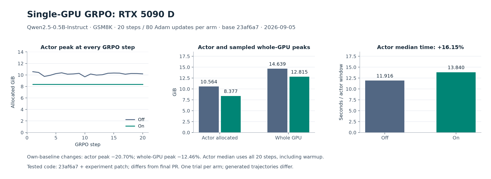

# Supplemental single-GPU observations

This 20-step RTX 5090 D GRPO experiment supplements the main two-A800 results.
The tested version and workload are recorded below.

## RTX 5090 D: single-GPU GRPO



Date: 2026-09-05. One RTX 5090 D, Qwen2.5-0.5B-Instruct, GSM8K, 20 GRPO steps
and 80 AdamW updates per arm. Each arm consumed 160 prompts with four responses
each. The training subset contains 256 examples; validation uses 64 held-out
examples. Prompt and response limits are 512 tokens each.

Tested code: base `23af6a7a2e8d6efeeb2adbe5d1689c7a24f503a3` plus the
three-file experiment patch in the evidence archive; differs from the final PR
revision. It loads optimizer states before gradient clipping through an opt-in
optimizer wrapper. The final PR loads states after clipping in the finite-gradient
branch and preserves the automatic/manual training-context policy.

| Metric | Off | On | Observed change |
|---|---:|---:|---:|
| Full actor-window allocated peak | 10.5635 GiB | 8.3766 GiB | −20.70% |
| Whole-GPU sampled NVML peak | 14.6393 GiB | 12.8151 GiB | −12.46% |
| Actor-window median, all 20 steps | 11.9157 s | 13.8404 s | +16.15% |

Actor measurements cover the complete `TrainingWorker.train_mini_batch` window,
including context entry/exit and state transfers. NVML sampled the whole GPU
approximately every 100 ms. These are different memory scopes. All axes start
at zero, and every measured actor peak is plotted without smoothing.

There was one trial per arm, and generated trajectories differed. Timing is
observational, not an isolated measurement of transfer cost. The median includes
all 20 steps, unlike the steps-6–100 median in the dual-A800 main result. The two
workloads differ in model, hardware, source version and training length, so their
percentage reductions cannot establish that single-GPU execution benefits more
in general. No model-quality or final-code capacity/OOM claim is made here.

## Evidence and regeneration

Download [single_gpu_evidence.zip](single_gpu_evidence.zip?raw=1), 206,062 bytes.
Its SHA-256 is:

```text
37df72fa3605d08cf6d04fd86d2ef3191b8c46bb05167ccd3ea52ac97accb660
```

The archive contains 33 files: selected actor/optimizer observations, NVML
samples, metrics, command/exit records, model/data metadata, original measurement
scripts and the tested patch. The 28 selected 5090 export files were checked against the original export manifest.
Model weights, full checkpoint shards, SSH configuration and setup/download logs
are excluded. Files inside the archive have their own `SHA256SUMS`.

`plot_data.json` contains all plotted values and SHA-256 hashes for the 12 files
read by the extraction script. Extraction checks all 20 actor windows / 80 Adam
updates per arm, raw peak and timing statistics against the saved summary, and
NVML peak directly from the sampled CSV.

```bash
unzip single_gpu_evidence.zip -d evidence
(cd evidence && shasum -a 256 -c SHA256SUMS)
uv venv --python 3.12 .venv
uv pip install --python .venv/bin/python matplotlib==3.11.1
.venv/bin/python plot_single_gpu.py --evidence evidence --out regenerated
# Alternatively, redraw the exported values directly:
.venv/bin/python plot_single_gpu.py --data plot_data.json --out regenerated-data
```

The output includes PNG, SVG and numerical data. This reconstructs the figure;
it does not launch training. Historical training scripts retain their original
paths. Use the [current reviewer kit](../reviewer_kit/README.md) to validate the
current feature branch. Codex assisted in plotting and documenting these
existing records. Licenses for the selected source/data material are included
in the evidence archive.
